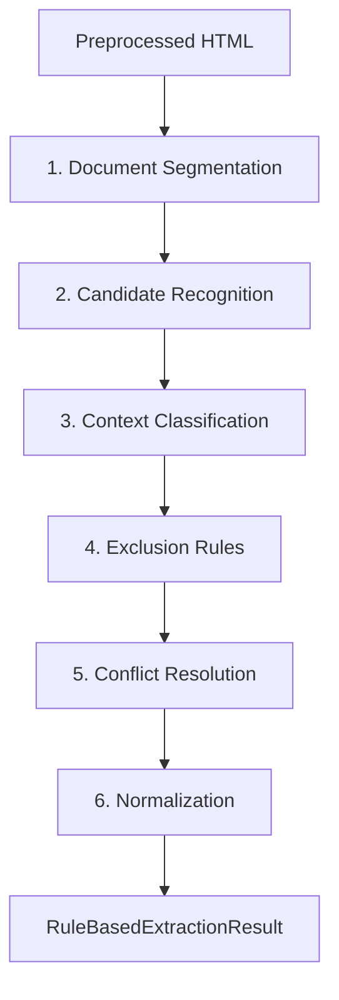
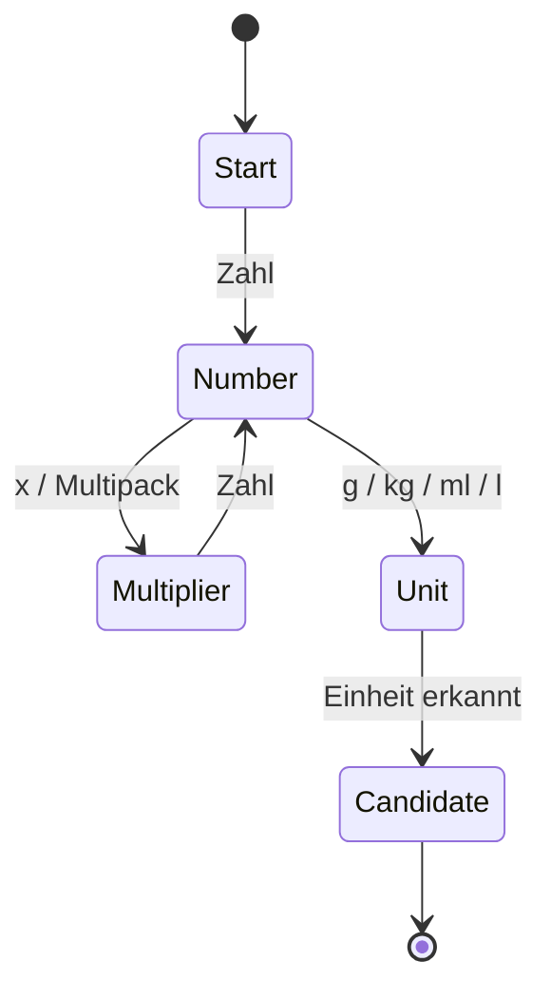
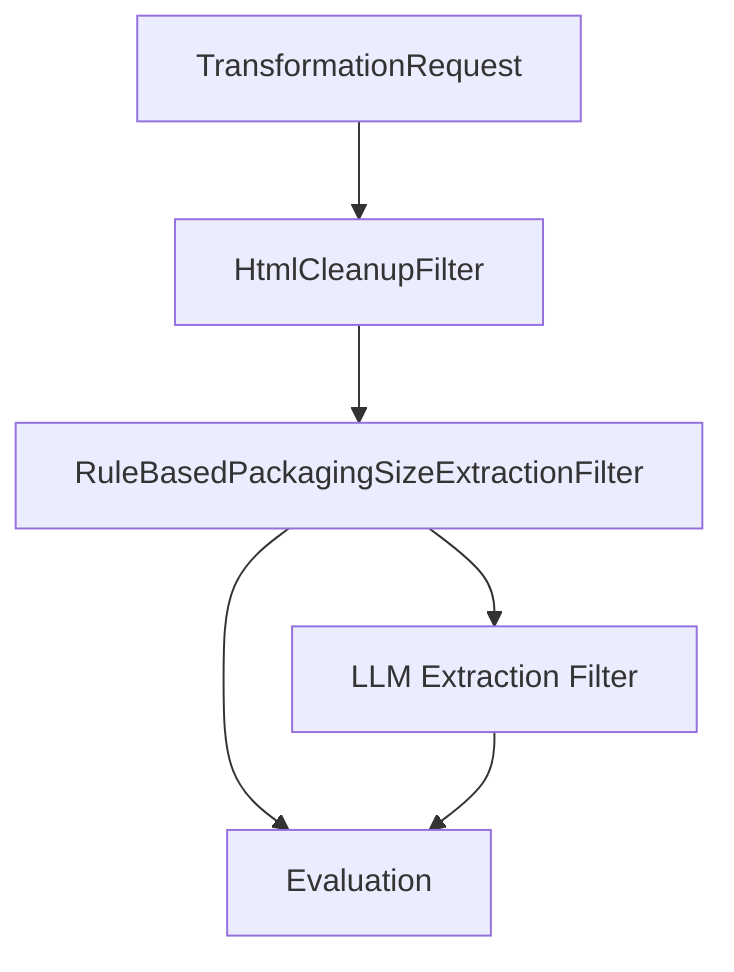

# Regelbasierter Referenz-Wrapper: Herleitung und Architektur

## 1. Ziel des regelbasierten Referenzansatzes

Der regelbasierte Referenzansatz dient als deterministische Vergleichsbasis zum LLM-basierten Extraktionsverfahren. Er soll bewusst keine Machine-Learning- oder LLM-Komponenten verwenden. Dadurch kann in der Evaluation untersucht werden, wie sich ein explizit konstruierter, nachvollziehbarer und wartbarer Wrapper gegenüber einem semantisch flexibleren LLM-Ansatz verhält.

Der Wrapper wird nicht als vollständiges Alternativsystem für die gesamte Produktdatenextraktion entworfen. Stattdessen wird er auf ein ausgewähltes Referenzfeld begrenzt. Für den vorliegenden Use Case eignet sich insbesondere die Extraktion der Produkt- bzw. Verpackungsgröße, da dieses Feld formal gut beschreibbar ist, häufig in Shop-HTML vorkommt und dennoch relevante Fehlerquellen enthält. Beispiele sind die Verwechslung von Nettofüllmenge, Grundpreis, Referenzwert, Versandkosten, Pfand oder Variantenangaben.

Ziel ist daher die Konstruktion eines regelbasierten, kaskadierten Web-Wrappers, der aus bereinigtem Shop-HTML eine strukturierte `ProductSizing`-Instanz erzeugt.

## 2. Methodische Grundlage: Finite-State Information Extraction

Finite-State-Ansätze beruhen darauf, Eingabesequenzen schrittweise anhand formaler Zustände und Übergänge zu verarbeiten. Ein Finite-State Transducer erkennt dabei nicht nur Muster, sondern erzeugt aus erkannten Mustern auch eine Ausgabe oder Annotation. Für Information Extraction ist diese Idee nützlich, weil viele relevante Informationen in Texten und HTML-Seiten durch wiederkehrende Oberflächenmuster beschrieben werden.

Ein klassischer Bezugspunkt ist FASTUS von Hobbs et al. Das System beschreibt Information Extraction als Kaskade mehrerer einfacher finite-state Verarbeitungsschritte. Zunächst werden feste Ausdrücke erkannt, danach größere syntaktische Gruppen gebildet, anschließend Ereignismuster identifiziert und am Ende zusammengeführt. Die zentrale methodische Idee besteht darin, nicht einen komplexen vollständigen Parser zu bauen, sondern mehrere einfache und effiziente Verarbeitungsschritte zu kombinieren. Siehe [Hobbs et al.: FASTUS](https://arxiv.org/abs/cmp-lg/9705013).

Für Webdaten ist SoftMealy von Hsu und Dung besonders relevant. Der Ansatz adressiert semi-strukturierte Webquellen und nutzt finite-state Transducer zusammen mit Kontextregeln. Wichtig ist hierbei, dass Webdaten nicht vollständig frei formuliert sind, aber auch nicht vollständig standardisiert. Genau diese Zwischenposition trifft auch auf bereinigtes Shop-HTML zu: Produktinformationen sind oft in wiederkehrenden Mustern vorhanden, aber je Shop unterschiedlich formatiert. Siehe [Hsu und Dung: Generating finite-state transducers for semi-structured data extraction from the Web](https://www.sciencedirect.com/science/article/pii/S0306437998000271).

Friburger und Maurel zeigen zusätzlich, dass finite-state Transducer als Kaskaden zur Extraktion von Entitäten eingesetzt werden können. Für den vorliegenden Use Case ist nicht das konkrete Extraktionsziel entscheidend, sondern die Architekturidee: mehrere Transducer bzw. Regelstufen werden nacheinander angewendet, wobei jede Stufe den Text annotiert oder transformiert. Siehe [Friburger und Maurel: Finite-state transducer cascades to extract named entities in texts](https://www.sciencedirect.com/science/article/pii/S0304397503005371).

Lin et al. sind nur eingeschränkt übertragbar. Die Arbeit behandelt Open Information Extraction und extrahiert Beziehungen zwischen Entitäten. Der fachliche Gegenstand unterscheidet sich also deutlich vom Produktdaten-Use-Case. Übertragbar ist lediglich die technische Grundidee, deklarative Kontextregeln mit einem kaskadierten finite-state Matching zu verbinden. Die Quelle sollte daher nicht als fachliche Blaupause, sondern nur als ergänzender Beleg für moderne regelbasierte Kaskaden verwendet werden. Siehe [Lin et al.: A Rule Based Open Information Extraction Method Using Cascaded Finite-State Transducer](https://researchr.org/publication/LinWZWYL16).

## 3. Übertragung auf den Produktdaten-Use-Case

Die Übertragung der FST-Grundlage auf den eigenen Wrapper erfolgt über eine Reduktion des Problems: Statt offene Relationen oder komplexe Ereignisse zu extrahieren, wird ein geschlossenes Attributschema befüllt. Der Wrapper muss also nicht beliebige Produktinformationen verstehen, sondern gezielt Kandidaten für Verpackungsgrößen erkennen und bewerten.

Die methodische Abbildung sieht folgendermaßen aus:

| FST-Konzept | Entsprechung im Wrapper |
|---|---|
| Eingabesequenz | Bereinigtes `preprocessed_html`, daraus gewonnene Text- und DOM-Ausschnitte |
| Token | Zahlen, Einheiten, Labels, HTML-Tags, Klassen, IDs, Kontextwörter |
| Zustand | Erkennungsphase, z. B. `START`, `NUMBER_FOUND`, `UNIT_FOUND`, `CANDIDATE_FOUND` |
| Transition | Regel, z. B. Zahl gefolgt von Einheit |
| Ausgabe | Annotation wie `SIZE_CANDIDATE(value=500, unit=g, source=title)` |
| Kaskade | Mehrere aufeinanderfolgende Regelstufen |
| Finale Ausgabe | `ProductSizing(value=500, unit="g", original_value="500 g")` |

Der entscheidende Punkt ist, dass der Wrapper nicht nur mit einem einzelnen regulären Ausdruck arbeitet. Ein einzelnes Muster wie `\d+\s*(g|kg|ml|l)` erkennt zwar Mengenangaben, kann aber nicht zuverlässig entscheiden, ob es sich um eine Verpackungsgröße, einen Grundpreis oder einen Referenzwert handelt. Deshalb wird die Extraktion als Kaskade entworfen.

## 4. Literaturbasierte Einordnung als Web-Wrapper

Ferrara et al. beschreiben Web Data Extraction als Aufgabe, Daten aus Webquellen zu extrahieren, in strukturierte Formate zu überführen und weiterzuverarbeiten. Die Autoren zeigen auch, dass klassische Web-Wrapper häufig domänenspezifisch, wartungsintensiv und anfällig gegenüber strukturellen Änderungen der Webseiten sind. Diese Eigenschaften sind für die Thesis besonders wichtig: Der regelbasierte Wrapper ist gut nachvollziehbar und effizient, aber gerade aufgrund seiner expliziten Regeln weniger flexibel als ein LLM. Siehe [Ferrara et al.: Web Data Extraction: Applications and Techniques: A Survey](https://www.sciencedirect.com/science/article/pii/S0950705114002640).

Lixto und Elog sind relevante Beispiele für deklarative Web-Wrapper. Sie zeigen, dass Web-Extraktion auch durch explizit formulierte Regeln und Muster beschrieben werden kann. Für den eigenen Wrapper ist vor allem die Idee wichtig, Extraktionslogik nicht implizit in einem Modell, sondern explizit in Regeln, Mustern und Kontextbedingungen abzubilden. Siehe [Baumgartner et al.: Visual Web Information Extraction with Lixto](https://www.researchgate.net/publication/2381127_Visual_Web_Information_Extraction_with_Lixto) und [Baumgartner et al.: The Elog Web Extraction Language](https://www.researchgate.net/publication/200034141_The_Elog_Web_Extraction_Language).

XPath- und DOM-basierte Wrapper sind ebenfalls relevant, weil der Input nicht nur freier Text, sondern bereinigtes HTML ist. Ein Wrapper kann daher neben Textmustern auch die Position eines Treffers im Dokument auswerten, z. B. ob ein Kandidat in einer Produktüberschrift, einer Produktdetailtabelle oder einem Grundpreisbereich steht. Siehe [Liu und Ma: Web Data Extraction Research Based on Wrapper and XPath Technology](https://www.scientific.net/AMR.271-273.706).

Strukturierte Webdaten wie Schema.org können als zusätzliche deterministische Quelle dienen. Falls Produktdaten über Microdata, RDFa oder JSON-LD vorhanden sind, können diese ohne LLM ausgewertet werden. Allerdings ist diese Quelle nicht in allen Shops vollständig oder zuverlässig verfügbar. Sie sollte daher als optionale Ergänzung, nicht als alleinige Grundlage des Wrappers behandelt werden. Siehe [Guha et al.: Schema.org: Evolution of Structured Data on the Web](https://queue.acm.org/detail.cfm?id=2857276) und [Selvam und Kejriwal: On using Product-Specific Schema.org from Web Data Commons](https://arxiv.org/abs/2007.13829).

## 5. Erste Architektur des Wrappers

Der Wrapper wird als kaskadierte Pipeline entworfen. Jede Stufe hat eine klar abgegrenzte Aufgabe und erzeugt entweder Zwischenannotation oder verwirft Kandidaten.



### 5.1 Document Segmentation

In dieser Stufe wird das bereinigte HTML in relevante Zonen zerlegt. Ziel ist nicht, bereits Produktgrößen zu extrahieren, sondern Treffer später besser bewerten zu können.

Mögliche Zonen:

| Zone | Beispiele |
|---|---|
| Produktüberschrift | `h1`, `title`, produktnahe Header |
| Produktdetails | Tabellen, Definitionslisten, technische Daten |
| Preisbereich | Preis, Grundpreis, Pfand |
| Inhaltsbereich | Abschnitte mit Labels wie `Inhalt`, `Nettofüllmenge`, `Füllmenge` |
| Variantenbereich | Selects, Buttons, Optionslisten |
| Irrelevanter Bereich | Breadcrumbs, Footer, Versand, Empfehlungen |

Das Ergebnis ist eine Liste von Dokumentzonen mit Text, DOM-Hinweisen und Priorität.

### 5.2 Candidate Recognition

Diese Stufe erkennt formale Mengenmuster. Sie entspricht am stärksten dem klassischen finite-state Matching.

Beispiele für positive Kandidaten:

```text
500 g
1 kg
0,75 l
750 ml
6 x 250 ml
2 Beutel à 100 g
Nettofüllmenge: 330 ml
```

Beispielhafte Zustandslogik:



Das Ergebnis dieser Stufe ist noch keine finale Verpackungsgröße, sondern nur eine Kandidatenliste.

### 5.3 Context Classification

In dieser Stufe wird bewertet, in welchem Kontext ein Kandidat steht. Diese Bewertung ist entscheidend, weil viele falsche Treffer formal wie Produktgrößen aussehen.

Positive Kontexte:

| Kontext | Beispiele |
|---|---|
| Nettofüllmenge | `Nettofüllmenge`, `Füllmenge`, `Inhalt` |
| Produktname | `Bio Apfelsaft 1 l`, `Schokolade 100 g` |
| Produktdetails | Tabelle mit Label `Inhalt` |
| Variantenoption | `Packung 500 g`, `Flasche 750 ml` |

Negative Kontexte:

| Kontext | Beispiele |
|---|---|
| Grundpreis | `1 kg = 4,99 EUR`, `100 g = 0,79 EUR` |
| Referenzwert | `pro 100 ml`, `je 100 g` |
| Nährwerte | `Nährwerte pro 100 g` |
| Versand/Mindestbestellwert | `Versandkostenfrei ab 20 EUR` |
| Pfand | `zzgl. 0,25 EUR Pfand` |

### 5.4 Exclusion Rules

Nach der Kontextklassifikation werden Kandidaten mit eindeutig falschem Kontext verworfen. Diese Stufe schützt vor hoher False-Positive-Rate.

Beispielregeln:

```text
Wenn Kandidat in Grundpreis-Kontext steht, verwerfe Kandidat.
Wenn Kandidat unmittelbar nach "pro" oder "je" steht, verwerfe Kandidat.
Wenn Kandidat in Nährwerttabelle als Bezugsbasis steht, verwerfe Kandidat.
Wenn Kandidat in Versand-, Rabatt- oder Pfandkontext steht, verwerfe Kandidat.
```

### 5.5 Conflict Resolution

Wenn mehrere gültige Kandidaten übrig bleiben, entscheidet der Wrapper deterministisch.

Priorisierungsvorschlag:

| Priorität | Quelle |
|---:|---|
| 1 | Explizites Label `Nettofüllmenge`, `Inhalt`, `Füllmenge` |
| 2 | Produktdetailtabelle |
| 3 | Produktüberschrift |
| 4 | Variantenbereich |
| 5 | Metadaten oder Seitentitel |

Bei mehreren Produktvarianten kann der Wrapper entweder mehrere `ProductSizing`-Objekte erzeugen oder, falls nur ein einzelnes Referenzfeld evaluiert werden soll, den Fall als mehrdeutig markieren. Für die Evaluation sollte diese Entscheidung vorher festgelegt werden.

### 5.6 Normalization

In der letzten Stufe wird der Kandidat in das Zielmodell überführt.

Beispiel:

```json
{
  "value": 500,
  "unit": "g",
  "original_value": "500 g",
  "normalized_value": 0.5,
  "normalized_unit": "kg"
}
```

Mögliche Normalisierungsregeln:

| Eingabe | Ausgabe |
|---|---|
| `500 g` | `value=500`, `unit=g`, `normalized_value=0.5`, `normalized_unit=kg` |
| `750 ml` | `value=750`, `unit=ml`, `normalized_value=0.75`, `normalized_unit=l` |
| `0,75 l` | `value=0.75`, `unit=l`, `normalized_value=0.75`, `normalized_unit=l` |
| `2 x 250 g` | entweder `value=500`, `unit=g` oder zusätzlich Multipack-Metadaten |

Die Multipack-Entscheidung muss fachlich festgelegt werden. Für eine reine Verpackungsgrößen-Baseline ist meist sinnvoll, den Gesamtinhalt zu normalisieren und den Originalwert zusätzlich zu speichern.

## 6. Einordnung in die bestehende Pipeline

Der Wrapper kann als eigener Filter nach dem HTML-Cleanup integriert werden. Er verwendet `request.preprocessing.preprocessed_html` als Hauptquelle und schreibt sein Ergebnis nach `request.rule_based_extraction`.



Die regelbasierte Extraktion sollte unabhängig vom LLM-Ergebnis laufen. Dadurch kann später dieselbe Ground Truth gegen beide Ansätze evaluiert werden.

Mögliche Zielstruktur:

```python
class RuleBasedExtractionResult(BaseModel):
    packaging_size: ProductSizing | None = None
    raw_matches: list[str] = Field(default_factory=list)
    processed_at: datetime | None = None
```

Für die Evaluation kann zusätzlich sinnvoll sein, interne Kandidaten und Entscheidungsgründe zu speichern. Falls das bestehende Modell bewusst schlank bleiben soll, können diese Informationen alternativ in `raw_matches` oder in einer separaten Evaluationsstruktur abgelegt werden.

## 7. Wissenschaftliche Positionierung

Der geplante Wrapper ist kein trainiertes Modell und keine automatische Wrapper-Induction. Er wird manuell aus fachlichen Regeln konstruiert. Dadurch ist er gut erklärbar und deterministisch, aber nur begrenzt flexibel gegenüber neuen Layouts und Schreibweisen.

Eine passende Formulierung für die Arbeit wäre:

> Der regelbasierte Referenzansatz wird als kaskadierter, finite-state-inspirierter Web-Wrapper konzipiert. In mehreren deterministischen Verarbeitungsstufen werden zunächst formale Mengenmuster im bereinigten Shop-HTML erkannt, anschließend anhand ihres lokalen Kontextes klassifiziert, durch Ausschlussregeln bereinigt und abschließend in das Zielmodell normalisiert. Der Ansatz nutzt keine ML- oder LLM-Komponenten und dient als nachvollziehbare Baseline für den Vergleich mit dem LLM-basierten Extraktionsverfahren.

Diese Positionierung ist methodisch sauber, weil sie die FST-Literatur nicht überdehnt. Der Wrapper übernimmt die kaskadierte, regelbasierte Verarbeitungslogik, ohne zu behaupten, ein vollständig formaler oder automatisch gelernter FST-Wrapper zu sein.

## 8. Geeignete Literaturbasis

### Kernliteratur

- Hobbs, J. R., Appelt, D., Bear, J., Israel, D., Kameyama, M., Stickel, M., Tyson, M. (1997). FASTUS: A Cascaded Finite-State Transducer for Extracting Information from Natural-Language Text. [arXiv](https://arxiv.org/abs/cmp-lg/9705013)
- Hsu, C.-N., Dung, M.-T. (1998). Generating finite-state transducers for semi-structured data extraction from the Web. [ScienceDirect](https://www.sciencedirect.com/science/article/pii/S0306437998000271)
- Friburger, N., Maurel, D. (2004). Finite-state transducer cascades to extract named entities in texts. [ScienceDirect](https://www.sciencedirect.com/science/article/pii/S0304397503005371)
- Ferrara, E., De Meo, P., Fiumara, G., Baumgartner, R. (2014). Web Data Extraction: Applications and Techniques: A Survey. [ScienceDirect](https://www.sciencedirect.com/science/article/pii/S0950705114002640)

### Ergänzende Literatur

- Baumgartner, R., Flesca, S., Gottlob, G. (2001). Visual Web Information Extraction with Lixto. [ResearchGate](https://www.researchgate.net/publication/2381127_Visual_Web_Information_Extraction_with_Lixto)
- Baumgartner, R., Flesca, S., Gottlob, G. (2001). The Elog Web Extraction Language. [ResearchGate](https://www.researchgate.net/publication/200034141_The_Elog_Web_Extraction_Language)
- Liu, H., Ma, Y. X. (2011). Web Data Extraction Research Based on Wrapper and XPath Technology. [Scientific.Net](https://www.scientific.net/AMR.271-273.706)
- Guha, R. V., Brickley, D., Macbeth, S. (2015/2016). Schema.org: Evolution of Structured Data on the Web. [ACM Queue](https://queue.acm.org/detail.cfm?id=2857276)
- Selvam, R. K., Kejriwal, M. (2020). On using Product-Specific Schema.org from Web Data Commons: An Empirical Set of Best Practices. [arXiv](https://arxiv.org/abs/2007.13829)
- Lin, H., Wang, Y., Zhang, P., Wang, W., Yue, Y., Lin, Z. (2016). A Rule Based Open Information Extraction Method Using Cascaded Finite-State Transducer. [Researchr](https://researchr.org/publication/LinWZWYL16)

## 9. Offene Architekturentscheidungen

Vor der Implementierung sollten folgende Entscheidungen festgelegt werden:

1. Soll der Wrapper genau eine Verpackungsgröße oder mehrere Größen extrahieren?
- Vielleicht erstmal auf eine Größe beschränken, um das system so einfach zu halten wie möglich
2. Soll bei Multipacks der Einzelinhalt oder der Gesamtinhalt als `value` gespeichert werden?
- Der Einzelinhalt. Beispiel: 6x0,33L cola dosen => Verpackungsgröße = 0,33L
3. Sollen JSON-LD- und Microdata-Informationen vor dem HTML-Cleanup gesichert werden?
- Json-LD soll ignoriert werden
4. Werden Entscheidungsgründe und verworfene Kandidaten für die Evaluation gespeichert?
- Nur im Kontext. Soll aber schlank gehalten sein
5. Wie wird Mehrdeutigkeit bewertet: als `null`, als Fehler oder als Kandidatenliste?
- Da muss es eine Entscheidungsliste geben, die die Mehrdeutigkeit auflöst
6. Wird die regelbasierte Extraktion vor, parallel zu oder nach der LLM-Extraktion ausgeführt?
- parallel zur LLM-Extraktion

Für eine saubere Baseline empfiehlt sich:

- genau ein primärer `packaging_size`-Wert,
- Gesamtinhalt bei Multipacks,
- Speicherung von `raw_matches`,
- deterministische Priorisierung,
- `null` bei nicht auflösbarer Mehrdeutigkeit,
- Ausführung direkt nach dem HTML-Cleanup und unabhängig vom LLM.

